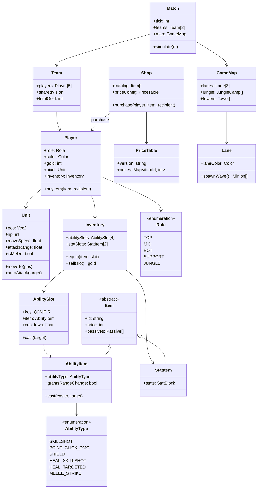

```mermaid
classDiagram
    class Match {
        +tick: int
        +teams: Team[2]
        +map: GameMap
        +simulate(dt)
    }

    class Team {
        +players: Player[5]
        +sharedVision
        +totalGold: int
    }

    class Player {
        +role: Role
        +color: Color
        +gold: int
        +pixel: Unit
        +inventory: Inventory
        +buyItem(item, recipient)
    }

    class Unit {
        +pos: Vec2
        +hp: int
        +moveSpeed: float
        +attackRange: float
        +isMelee: bool
        +moveTo(pos)
        +autoAttack(target)
    }

    class Inventory {
        +abilitySlots: AbilitySlot[4]
        +statSlots: StatItem[2]
        +equip(item, slot)
        +sell(slot) gold
    }

    class AbilitySlot {
        +key: Q|W|E|R
        +item: AbilityItem
        +cooldown: float
        +cast(target)
    }

    class Item {
        <<abstract>>
        +id: string
        +price: int
        +passives: Passive[]
    }

    class AbilityItem {
        +abilityType: AbilityType
        +grantsRangeChange: bool
        +cast(caster, target)
    }

    class StatItem {
        +stats: StatBlock
    }

    class AbilityType {
        <<enumeration>>
        SKILLSHOT
        POINT_CLICK_DMG
        SHIELD
        HEAL_SKILLSHOT
        HEAL_TARGETED
        MELEE_STRIKE
    }

    class Role {
        <<enumeration>>
        TOP
        MID
        BOT
        SUPPORT
        JUNGLE
    }

    class Shop {
        +catalog: Item[]
        +priceConfig: PriceTable
        +purchase(player, item, recipient)
    }

    class PriceTable {
        +version: string
        +prices: Map~itemId, int~
    }

    class GameMap {
        +lanes: Lane[3]
        +jungle: JungleCamp[]
        +towers: Tower[]
    }

    class Lane {
        +laneColor: Color
        +spawnWave() Minion[]
    }

    Match --> Team
    Match --> GameMap
    Team --> Player
    Player --> Unit
    Player --> Inventory
    Inventory --> AbilitySlot
    Inventory --> StatItem
    AbilitySlot --> AbilityItem
    Item <|-- AbilityItem
    Item <|-- StatItem
    AbilityItem --> AbilityType
    Player --> Role
    Shop --> PriceTable
    Shop ..> Player : purchase
    GameMap --> Lane
```
